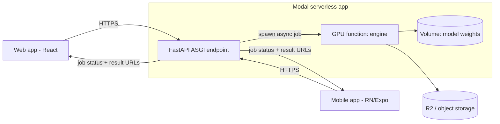

# Old Photo Restoration — Product Design Spec

**Date:** 2026-07-24
**Status:** Approved (design), pending implementation plan
**Author:** kartikver-674

## Summary

Transform the existing ~130-line GFPGAN wrapper into a real product: a smart
multi-model restoration **engine** exposed through a **REST API** on Modal,
consumed by a **web app** and a **mobile app**.

**Locked-in decisions:**
- Inference host: **Modal** (serverless GPU, scale-to-zero, `spawn`-based jobs)
- Goal: **a usable tool** (not a research repo)
- Timeline: **2–4 weeks part-time** to first impressive version (M2)
- Developer strength: **React / React Native** → frontend is home turf; the new
  work is the Python inference service.

This spec deliberately cuts ~70% of the originally-brainstormed feature wishlist
(video, webcam, OCR, face clustering, semantic search, TensorRT, ONNX, desktop
GUI, diffusion models) to go deep on a small, correct, shippable core. Cut items
are recorded in §12 / `docs/future.md`, not lost.

## 1. Current limitations

| # | Limitation | Consequence |
|---|---|---|
| 1 | Single model (GFPGAN 1.3), always used | No adaptation to degradation type; heavy damage restores poorly |
| 2 | Shells out to `inference_gfpgan.py` via subprocess | No intermediate inspection, no per-face control, brittle |
| 3 | CLI-only, local-only | Not a product; no API, web, mobile, or remote GPU |
| 4 | No input analysis | Can't route models or explain results |
| 5 | No colorization / scratch removal | Misses the two features users expect most |
| 6 | No async/job model | Long restores block; no batch, no progress |
| 7 | Only visual before/after | No objective quality signal, no history |
| 8 | GFPGAN pinned in one `.py` | Untestable, unshippable as a component |

**Root cause:** it's a *script that calls a model*, not an *engine behind an API*.

## 2. Architecture



**Decision A — the engine is a pure Python library with zero web/cloud imports.**
Develop and unit-test locally on Mac (MPS/CPU) before Modal is involved; the API
becomes a thin wrapper; independently benchmarkable.
- *Alternative rejected:* model calls inside FastAPI routes — untestable, couples
  inference to HTTP.
- *Cost:* one package boundary. Worth it.

**Decision B — Modal hosts the FastAPI endpoint, the GPU function, AND the job
queue.** `Function.spawn()` returns a call id polled via
`FunctionCall.from_id().get()` — that *is* an async job system.
- *Alternative rejected:* FastAPI on Render + Celery + Redis + GPU worker — 4
  moving parts for what Modal gives in one.
- *Cost:* Modal lock-in for the deploy layer only; the engine stays portable.

## 3. Folder structure (monorepo)

```
photo-restore/
├── engine/                     # pure restoration library — NO web deps
│   ├── restore_engine/
│   │   ├── analysis.py         # blur, noise, resolution, grayscale, face-count
│   │   ├── router.py           # transparent rule-based model selection
│   │   ├── pipeline.py         # orchestrates stages, returns Result + metadata
│   │   ├── config.py           # model versions, thresholds (calibration knobs)
│   │   ├── types.py            # RestoreRequest / RestoreResult dataclasses
│   │   └── models/
│   │       ├── faces.py        # GFPGAN 1.4 + CodeFormer behind one interface
│   │       ├── upscale.py      # Real-ESRGAN
│   │       ├── colorize.py     # DDColor            (F2)
│   │       └── inpaint.py      # BOPBTL scratch fix  (F4)
│   ├── cli.py                  # local use, replaces today's restore.py
│   └── tests/
├── api/                        # Modal app: FastAPI + GPU fns + spawn jobs
│   ├── app.py  jobs.py  storage.py
├── web/                        # React + Vite + Tailwind
├── mobile/                     # React Native (Expo)
├── benchmarks/                 # sample images, before/after grids, IQA scores
├── docs/                       # architecture.md, models.md, deploy-modal.md, future.md
├── .github/workflows/ci.yml    # ruff + pytest
└── README.md
```

**Principle:** `engine/` has no web/cloud dependencies. It runs, tests, and
benchmarks on the Mac standalone; `api/` is a thin Modal wrapper over it.

## 4. Technologies

| Layer | Choice | Why (vs the obvious alternative) |
|---|---|---|
| Engine | PyTorch, OpenCV, facexlib | Already the GFPGAN ecosystem |
| Face models | **GFPGAN 1.4 + CodeFormer** | Two complementary models cover natural↔severe degradation; more would be inventory, not capability |
| Upscale | **Real-ESRGAN** | Integrated, strong; SwinIR/HAT marginally better but far slower |
| Colorize (F2) | **DDColor** (DeOldify fallback) | Newer dual-decoder, better saturation control |
| Scratch (F4) | **BOPBTL** | Standard for scratch detect+inpaint; heaviest addition, parked |
| Infra | **Modal** | Serverless GPU + ASGI + job queue in one |
| Storage | **Cloudflare R2** | 10 GB free, **no egress fees**, S3-compatible |
| Web | **React + Vite + Tailwind** + `react-compare-slider` | Developer wheelhouse; slider sells "restoration" |
| Mobile | **React Native (Expo)** | Wheelhouse; trivial builds; shares API contract |
| Later (F3) | **Supabase** | Auth + Postgres + storage free tier for cross-device history |
| Dev | **uv, ruff, pytest, GitHub Actions** | Fast, boring, standard |

**Deliberately NOT used:** TensorRT/ONNX (premature — no latency problem yet),
diffusion SUPIR/DiffBIR (24 GB VRAM, 50–100× per-image cost, marginal face gain),
Celery/Redis (Modal covers it), Gradio/Streamlit + desktop GUI (the web app
replaces all three).

## 5. Model comparison

| Model | Type | Strength | Weakness | Wins when | Role |
|---|---|---|---|---|---|
| **GFPGAN** | GAN + face prior | Natural skin, identity-faithful, fast | Weak on severe degradation; over-smooths | Light/moderate face damage | ✅ Core default |
| **CodeFormer** | Transformer + codebook | Robust on heavy degradation; **fidelity knob `w`** | Low-`w` hallucinates | Very low-quality/tiny faces | ✅ Core routed |
| RestoreFormer++ | Transformer | Good texture | ~CodeFormer, no fidelity knob | — | Considered, not needed |
| GPEN | GAN | Fast, sharp | Less robust than CodeFormer | — | Considered, not needed |
| **Real-ESRGAN** | GAN SR | Great general upscaling | Not face-specialized | Backgrounds, whole-image SR | ✅ Core |
| BSRGAN | GAN SR | Realistic degradation model | Older, softer | — | Skip |
| SwinIR / HAT | Transformer SR | Top detail | Slow, heavy | Benchmark-grade SR | Skip |
| DiffBIR / SUPIR | Diffusion | Best on catastrophic damage | Huge VRAM, slow, costly, identity-risky | "Impossible" restorations | ⏸ Future tier |
| DDColor / DeOldify | Colorization | B&W→color | Can mute/misfire hues | B&W photos | ✅ F2 |
| BOPBTL | Triplet-domain | Scratch/tear detect+fill | Old, finicky, heavy | Physically damaged prints | ⏸ F4 |

**Complementarity:** analysis routes faces to GFPGAN/CodeFormer, everything else
to Real-ESRGAN, B&W adds DDColor, scratches add BOPBTL. Diffusion is a future
escalation tier for the worst inputs, gated on low GFPGAN/CodeFormer confidence.

## 6. Pipeline design

```
Ingest/normalize → Analysis → [Scratch inpaint*] → Face restore → Upscale → [Colorize*] → Light post → [IQA score] → Output
                      │            (F4)            GFPGAN/CodeFormer  Real-ESRGAN  (F2)                    (F5)
                      └── blur, noise, resolution, grayscale, face count/quality ──┐
                                                                                    ▼
                                                                 Router picks models + weights, transparently
```

- **Kept:** one cheap **Analysis** stage — blur (variance-of-Laplacian),
  grayscale (channel-correlation), face count/quality (detector), resolution.
  Feeds routing; returned to the user as *why* decisions were made.
- **Killed as separate ML stages:** damage/color-fade/blur/noise detection,
  contrast/sharpen, quality-scoring as 7 distinct heavyweight stages. Cheap
  versions fold into Analysis + light post-process; expensive versions add cost
  without changing product output quality.
- **Router is a transparent rule set, not a learned meta-model** — debuggable and
  honest; surfacing "chose CodeFormer because face quality was low" reads as more
  competent than a black box. Learned routing is a future direction (§12).

## 7. Milestone plan

| M | Milestone | Ships | Effort (part-time) |
|---|---|---|---|
| **M0** | Engine extraction | `restore.py` → clean `engine/` lib, GFPGAN **1.4**, common face interface, CLI, unit tests, `demo()` self-check. Runs on Mac. | 2–3 days |
| **M1** | Smart engine + API | + CodeFormer + fidelity knob + Analysis + rule router; Modal FastAPI with `spawn` jobs + R2; `POST /jobs`, `GET /jobs/{id}`; deployed. | 4–6 days |
| **M2** | **Web app** ← the demo | React: drag-drop, progress, before/after slider, download, local history; deployed to Cloudflare Pages. **Usable tool.** | 4–5 days |
| **M3** | Mobile app | RN/Expo: camera + gallery pick, same flows, share sheet. | 4–5 days |

**Fast-follows (post-4-weeks, independent):** F1 Batch/album (queue + UI, no new
model) · F2 Colorization (DDColor) · F3 Auth + cloud history/versioning
(Supabase) · F4 Scratch inpainting (BOPBTL, bigger GPU) · F5 No-reference IQA
(NIQE/BRISQUE) + HTML benchmark report.

## 8. Feature priority

1. **P0 (M0–M2):** engine library, CodeFormer + fidelity knob, rule router, Modal
   API + jobs, web app with slider. *Portfolio-worthy usable tool on its own.*
2. **P1 (M3 + F1):** mobile app, batch/album.
3. **P2 (F2–F3):** colorization, auth + history/versioning.
4. **P3 (F4–F5):** scratch inpainting, IQA + benchmark report, diffusion tier.

## 9. Effort estimate

- First impressive version (M0–M2): ~10–14 part-time days (fits 2–4 week window).
- Through M3: ~15–19 days.
- Fast-follows: F1 ~2d, F2 ~3d, F3 ~3d, F4 ~5d, F5 ~2d.

## 10. Papers to read

- GFPGAN — *Towards Real-World Blind Face Restoration with Generative Facial Prior* (Wang 2021)
- CodeFormer — *Towards Robust Blind Face Restoration with Codebook Lookup Transformer* (Zhou, NeurIPS 2022)
- Real-ESRGAN — *Training Real-World Blind SR with Pure Synthetic Data* (Wang 2021)
- DDColor — *Photo-Realistic Image Colorization via Dual Decoders* (2023)
- BOPBTL — *Bringing Old Photos Back to Life* (Wan, CVPR 2020)
- DiffBIR (2023), SUPIR (CVPR 2024) — future diffusion tier
- RestoreFormer++, GPEN — to justify *not* using them
- NIQE, BRISQUE, LPIPS — why full-reference PSNR/SSIM don't apply to real old photos

## 11. Repos to study

`TencentARC/GFPGAN` · `sczhou/CodeFormer` · `xinntao/Real-ESRGAN` ·
`piddnad/DDColor` · `microsoft/Bringing-Old-Photos-Back-to-Life` ·
`modal-labs/modal-examples` · `XPixelGroup/DiffBIR` · `Fanghua-Yu/SUPIR`.

## 12. Future directions (recorded, not built)

- Learned degradation-aware routing (classifier predicting best model per image).
- Identity-preservation guardrail (ArcFace embedding distance input↔output to
  auto-reject hallucinated faces).
- Diffusion escalation tier with a confidence gate.
- Adaptive blending from local degradation maps.
- Parked wishlist items: video, webcam/real-time, OCR, face clustering, semantic
  search, film-grain, relighting, HDR, animation, TensorRT/ONNX.

## 13. Deployment strategy

- **Engine:** unit-tested locally (Mac MPS/CPU); CI runs ruff + pytest on CPU with
  a tiny fixture.
- **API + GPU:** Modal `modal deploy` from CI; weights baked into a Modal Volume
  (downloaded once, not per cold-start); jobs via `spawn`; results to R2 with
  presigned download URLs.
- **Web:** Cloudflare Pages / Vercel, env-configured API base URL.
- **Mobile:** Expo EAS builds; same API.
- **Cost control:** scale-to-zero (~$0 idle); per-image cents; R2 no-egress; hard
  image-size cap + per-job timeout so a pathological input can't run up cost.
- **Observability:** Modal logs/metrics; every job response returns timings +
  models-used + IQA (doubles as benchmark data).
